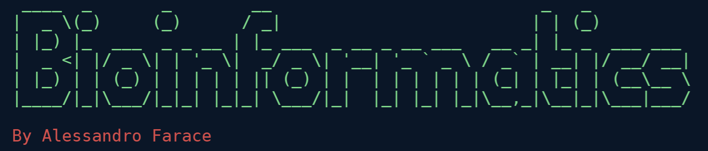

---

This is a repository of all the algorithms covered in the **Bioinformatics Course** part of the **Cambridge Computer Science Tripos**

For some explanations, check out [The Moon](https://publish.obsidian.md/afv/Index/Bioinformatics+Index)

# Algorithms Implemented:

## **Alignment Problems:**

- [x] [Needleman-Wunsch](bioinformatics/algorithms/needleman_wunsch.py)
  - [ ] Calculate LCS and Edit Distance using this approach
- [x] [Waterman-Smith](bioinformatics/algorithms/waterman_smith.py)
- [ ] Affine Gap Model
- [ ] Nussinov RNA Folding
- [ ] Space Efficient Global Alignment (#todo cleanup)
- [x] [Method of Four Russians for LCS](bioinformatics/algorithms/four_russians_binary_encoding.py)
  - [ ] Extend to Edit Distance, Block Alignment and Global Alignment (for very simple score matrices)
- [ ] The CLUSTAL W Mutliple Alignment

## **Phylogeny (Evolutionary Tree) Algorithms**:

### **Distance Based**:

- [x] [Limb Length](bioinformatics/algorithms/limb_length.py) - O(n^2) and O(n) solutions
- [x] [Additive Phylogeny](bioinformatics/algorithms/additive_phylogeny.py)
- [x] [UPGMA](bioinformatics/algorithms/upgma.py) - O(N^2 log(n)) solution using priority queue
- [x] [Neighbour Joining](bioinformatics/algorithms/neighbour_joining.py)

### **Parsimony Based**:

- [x] [Small Parsimony](bioinformatics/algorithms/small_parsimony.py)
- [ ] Greedy Heuristic for Large Parsimony

## **Genome Sequencing**:

- [x] [K-mer Composition](bioinformatics/algorithms/string_composition.py)
- [x] [Overlap Graph Problem](bioinformatics/algorithms/sequencing_graph.py)
- [x] [De Bruijn Graph](bioinformatics/algorithms/sequencing_graph.py) - create from string, kmers or paired kmers
- [x] [Eulerian Problems](bioinformatics/algorithms/eulerian_cycle.py) - finding eulerian cycles and paths.
- [x] [Reconstruct Genome / Sequence](bioinformatics/algorithms/reconstruct_genome_string.py) - reconstruct genome from genome path (path through a De Bruijn Graph), kmers and paired kmers. Construct a k-universal circular string.

## **Clustering**

- [x] [Farthest-Clustering](bioinformatics/algorithms/clustering.py) - gets the set of centres found iteratively via max dist of (min dist to a centre)
- [x] [Distortion Metric](bioinformatics/algorithms/clustering.py)
- [x] [Hard K-Means / Lloyd Algorithm](bioinformatics/algorithms/clustering.py)
- [x] [Soft K-Means](bioinformatics/algorithms/clustering.py) - using the parition function with stiffness
- [ ] [Hierarchical Clustering]
- [ ] [Markov Clustering Algorithm]

## **Pattern Matching**

- [x] [Tries and Suffix Tries](/bioinformatics/algorithms/trie.py) - the suffix trie implemented is not the O(n) version which requires pointers etc. It is O(n^2).
- [x] [Burrows-Wheeler Transform and Matching](/bioinformatics/algorithms/burrows_wheeler.py)

## **Hidden Markov Models**

- [x] [HMM Evaluate](bioinformatics/algorithms/hmm.py) - find probs of hidden path or visible path given hidden path
- [x] [HMM Decode/Viterbi](bioinformatics/algorithms/hmm.py) - Viterbi
- [x] [HMM Forward](bioinformatics/algorithms/hmm.py)
- [ ] [HMM Backward](bioinformatics/algorithms/hmm.py)
- [ ] [Viterbi Learning](bioinformatics/algorithms/hmm.py)
- [ ] [Baum-Welch](bioinformatics/algorithms/hmm.py)

# Additional Files Explained:

- [Demos](bioinformatics/demos.py) - **A list of functions that can be used to demo the algorithms**
- [Scoring Functions](bioinformatics/algorithms/scoring_functions.py) - Stores different scoring matrices encapsulated into a function to use in alignment problems
- [Alignment-Graph](bioinformatics/algorithms/alignment_graph.py)- A class for representing alignment/edit graphs
- [Rosalind](bioinformatics/rosalind) - Answers to the **[Rosalind](http://rosalind.info/problems/list-view/?location=bioinformatics-textbook-track) Questions**
